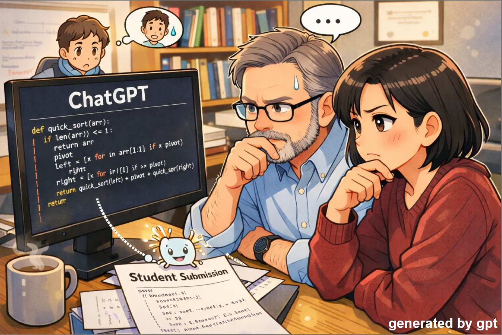
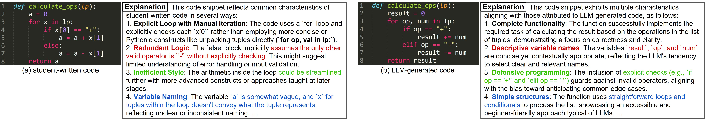

# LLM-code-detector
[](https://dl.acm.org/doi/10.1145/3770762.3772605)
[](https://docs.google.com/presentation/d/1MpV-FUMs_IQNV8-BTMsnbYU7yFi45BRgZStiU4XDMZM/edit?usp=sharing)

<p align="center">
  
</p>


## 🔍 Overview
Detect LLM-generated code with high accuracy — and explain why.

This repository provides the code and prompts for the paper:

**"LLM-Based Explainable Detection of LLM-Generated Code in Python Programming Courses"**


## ✨ Highlights
- 🔍 Detect LLM-generated code with **>99% accuracy in introductory Python programming courses**
- 💡 Generate **explanations (reasons for prediction)**
- 🤖 Finetune code LLMs (CodeLlama, CodeGemma, DeepSeekCoder)


## 📦 Setup
1. Create environment and install dependencies
```
conda create -n edu python=3.10 -y
conda activate edu

pip install -r requirements.txt
```

2. Set API key
Set your OpenAI API key as an environment variable:
```
export OPENAI_API_KEY="your_api_key_here"
```


## 📊 Data Generation 
<p align="center">
  
</p>

The dataset is constructed in two main steps:
#### 1. Generate LLM-written code
We prompt GPT-4o to solve programming assignments (problems/exercises) to generate **LLM-generated code.**
```
python generate_gpt4o.py 
```

#### 2. Generate explanations (reasons for prediction)
We provide GPT-4o with:
- LLM-generated code
- Student-written code

Then ask it to generate **explanations** describing why each code is likely written by an LLM or a student.
To generate explanations, first prepare your data according to the format described below. Then, run the scripts in the Generate Explanations section.

## 📁 Data Format
- Example data is provided under the `data/` directory.
- **Student-written code is NOT included** for privacy reasons.
- You should merge your own student data with the provided samples.

You can refer to the following files for the expected intermediate format:
```
data/train_wo_reason_for_prediction.jsonl
data/val_wo_reason_for_prediction.jsonl
data/test_wo_reason_for_prediction.jsonl
```

Steps:
1. Convert your data into `.jsonl` based on the key-value structure shown in the above files.
2. Combine:
- LLM-generated code ("label": 1)
- Student-written code ("label": 0)
3. Shuffle and split into `train/val/test`.


## 🧠 Generate Explanations
```
python generate_gpt4o_reason_for_prediction.py \
    -i data/train_wo_reason_for_prediction.jsonl \
    -o data/train.jsonl

python generate_gpt4o_reason_for_prediction.py \
    -i data/val_wo_reason_for_prediction.jsonl \
    -o data/val.jsonl

python generate_gpt4o_reason_for_prediction.py \
    -i data/test_wo_reason_for_prediction.jsonl \
    -o data/test.jsonl
```


## 🏋️ Fine-tuning
Run the following scripts depending on the model:
```
sh training_scripts/CodeLlama           # for CodeLlama
sh training_scripts/CodeGemma.sh        # for CodeGemma
sh training_scripts/DeepseekCoder.sh    # for DeepseekCoder

sh training_scripts/CodeGemma-woReason.sh   # for CodeGemma without explanation data
```

## 📈 Evaluation
Usage: `sh eval.sh {GPU_ID} {MODEL_NAME}`

Examples:
```
sh eval.sh 0 CodeLlama           # for CodeLlama
sh eval.sh 0 CodeGemma.sh        # for CodeGemma
sh eval.sh 0 DeepseekCoder.sh    # for DeepseekCoder

sh eval.sh 0 CodeGemma-woReason  # for CodeGemma without explanation data
```

## 📌 Citation
If you find this work useful, please cite:
```
@inproceedings{baek2026llm,
  title={LLM-Based Explainable Detection of LLM-Generated Code in Python Programming Courses},
  author={Baek, Jeonghun and Yamazaki, Tetsuro and Morihata, Akimasa and Mori, Junichiro and Yamakata, Yoko and Taura, Kenjiro and Chiba, Shigeru},
  booktitle={Proceedings of the 57th ACM Technical Symposium on Computer Science Education V. 1},
  year={2026}
}
```
